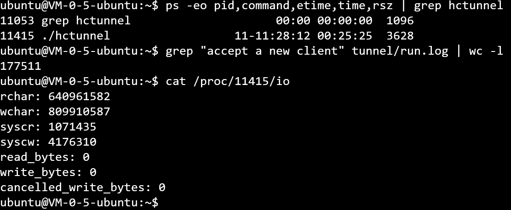
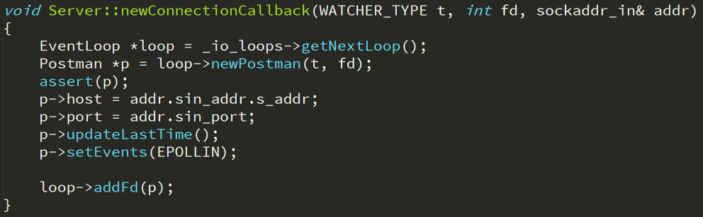
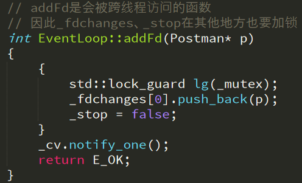

# hctunnel


### 介绍


hctunnel 是一个http tunnel工具，能够同时处理http和https请求。原理为，客户端首先与代理服务器建立TCP连接，然后代理服务器将请求转发给目标服务器，并且将目标服务器返回的内容转发给客户端。对于http请求，会直接将请求转发，对于https请求，代理服务器会首先回应客户端的CONNECT请求，然后转发HTTPS数据。


### 使用


```bash
cmake .
make
./hctunnel
```


自己在腾讯云上部署了一个最新版本的hctunnel，可以设置HTTP代理为`106.55.4.241:8888`来使用。例如，

```
user@ubuntu:~/hctunnel$ curl -x http://106.55.4.241:8888 myip.ipip.net
当前 IP：106.55.4.241  来自于：中国 广东 广州  电信/联通/移动
```
服务器上hctunnel的运行状态如下：



hctunnel的pid为1'1415，已经运行了11天11小时28分钟，cpu时间为25小时25分钟，目前占用内存3628KB，大约3.5兆。共处理了17'7511次代理请求，读入字节数约640兆，写出字节数约810兆。


### 实现

hctunnel是基于reactor事件驱动模型，只使用c++标准库完成的。默认开启五个线程，每个线程都有自己的事件循环。主线程用来accept新连接，并且分发连接给四个worker线程。worker线程用来管理连接，处理IO。

hctunnel的**内部实现**从源文件来看，主要有这几个class：

- Server：主线程中运行，有一个全局可访问的单例。负责accept新连接，并将新连接分配给线程池其中的一个线程。
- EventLoop：使用epoll作为多路复用机制。loop中监听事件，并且分发事件。由于EventLoop会被主线程和自己的线程两个线程调用，因此需要互斥量mutex。条件变量cv用来休眠和唤醒loop。
- IOWatcher：借鉴自libev中watcher的概念。IOWatcher作为一个抽象基类，提供了文件IO所必要的变量
- Postman：继承自IOWatcher，用来实现http tunnel。Postman是一个孪生的结构，分为local postman和remote  postman。local postman代表客户端与hctunnel这条连接，remote postman代表hctunnel与服务端的连接。根据这两种类型的postman，数据有两种流向：upstream、downstream，具体被分为四部分：upstreamRead、upstreamWrite、downstreamRead、downstreaWrite。


这几个class与reactor几个角色之间的**对应关系**：

| reactor角色                     | hctunnel中的class |
| ------------------------------- | ----------------- |
| Synchronous Event Demultiplexer | EventLoop         |
| Initiation Dispatcher           | EventLoop         |
| Event Handler                   | IOWatcher         |
| Concrete Event Handler          | Postman           |


### 线程安全的考虑

来自客户端的每条socket连接都分为两个阶段：accept阶段和IO阶段。其中accept阶段是由主线程处理，也就是Server来处理。IO阶段由其所归属的worker线程处理，连接关闭也发生在所属的worker线程。将两个阶段独立来看都是线程安全的，不需要任何的同步措施。

但是，在accept阶段和IO阶段之间，也就是主线程accept此socket之后，主线程需要将这个socket交给某个EventLoop，也就是某个worker线程。此时需要考虑线程安全，因为EventLoop中的某些函数会同时被主线程和自己所属的线程调用。为了保证线程安全，需要找出临界区和互斥资源。

**临界区**就是可能同时被多个线程同时调用的代码，也就是Server将连接交给EventLoop时所调用的代码。**互斥资源**就是临界区中的会被多个线程同时访问的那些数据。Server通过newConnectionCallback成员函数将accept到的socket连接交给线程池中的某个线程。从此得知，newPostman、updateLastTime、setEvents、addFd四个函数有可能同时被两个线程调用，需要加锁保护。host、port只在这里写入一次，之后不会再改变，因此不需要加锁。



需要注意的是，即使addFd的函数体已经加锁保护，addFd中所使用到的成员变量在其他成员函数中被访问依然需要加锁。否则，同一个成员变量可能会同时被两个线程操作，而出现不可预期的错误。newPostman函数也同样按此处理。



updateLastTime、setEvents两个函数理论上来说，也应该按照addFd那样的处理方式来加锁访问。但是updateLastTime、setEvents是Postman类的成员函数，不同于EventLoop类，Postman类的生命周期从newConnectionCallback函数开始，之后一直交给某个固定的EventLoop，直至消亡。因此，newConnectionCallback函数内调用updateLastTime和setEvents起到了初始化Postman的作用，在之后直到这个Postman消亡，也不会发生有多个线程同时调用同一个Postman实例的updateLastTime和setEvents成员函数的情况。因此，这两个函数以及其中涉及的变量不需要加锁访问。


### 待实现

- 使用eventfd替代条件变量实现线程的异步唤醒
- 使用time heap的方式代替目前的超时机制和epoll_wait的timeout参数
- 当域名无效以及其他http错误时，返回错误信息
- 单独开一个线程，用来记录日志
- 非阻塞connect
- "tcp segment of a reassembled pdu" 问题。（python的requests包，使用proxies选项）